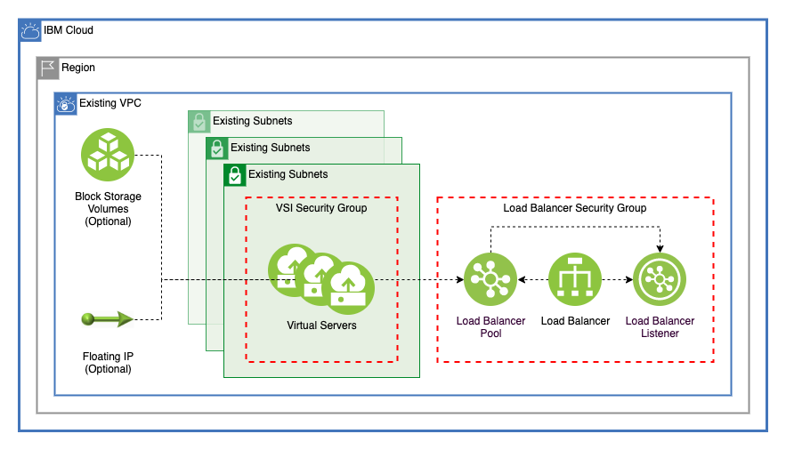

# IBM Secure Landing Zone VSI Module

[-brightgreen?style=plastic)](https://terraform-ibm-modules.github.io/documentation/#/badge-status)
[](https://github.com/semantic-release/semantic-release)
[](https://github.com/pre-commit/pre-commit)
[](https://github.com/terraform-ibm-modules/terraform-ibm-landing-zone-vsi/releases/latest)

This module creates virtual server instances (VSI) across multiple subnets with any number of block storage volumes that are connected by any number of load balancers.


---

## Prerequisites

- A VPC
- A VPC SSH key

---

## Virtual servers

This module creates virtual servers across any number of subnets in a single VPC that is connected by a single security group. You can specify the number of virtual servers to provision on each subnet by using the `vsi_per_subnet` variable. Virtual servers use the `prefix` variable to dynamically create names. These names are also used as the Terraform address for each virtual server, which allows for easy reference.

```terraform
module.vsi["test-vsi"].ibm_is_instance.vsi["test-vsi-1"]
module.vsi["test-vsi"].ibm_is_instance.vsi["test-vsi-2"]
module.vsi["test-vsi"].ibm_is_instance.vsi["test-vsi-3"]
```

---

## Block storage volumes

This module creates any number of identical block storage volumes. One storage volume that is specified in the `volumes` variable is created and attached to each virtual server. These block storage volumes use the virtual server name and the volume name to create easily identifiable and manageable addresses within Terraform:

```terraform
module.vsi["test-vsi"].ibm_is_volume.volume["test-vsi-1-one"]
module.vsi["test-vsi"].ibm_is_volume.volume["test-vsi-2-one"]
module.vsi["test-vsi"].ibm_is_volume.volume["test-vsi-3-one"]
module.vsi["test-vsi"].ibm_is_volume.volume["test-vsi-1-two"]
module.vsi["test-vsi"].ibm_is_volume.volume["test-vsi-2-two"]
module.vsi["test-vsi"].ibm_is_volume.volume["test-vsi-3-two"]
```

---

## Floating IP addresses

By using the `enable_floating_ip`, a floating IP address is assigned to each VSI created by this module. This floating IP address is displayed in the output, if provisioned.

---

## Load balancers

This module creates any number of application load balancers to balance traffic between all virtual servers that are created by this module. Each load balancer can optionally be added to its own security group. Use the `load_balancers` variable to configure the back-end pool and front-end listener for each load balancer.

---

## Usage

```terraform
module vsi {
  # Replace "main" with a GIT release version to lock into a specific release
  source                           = "git::https://github.com/terraform-ibm-modules/terraform-ibm-landing-zone-vsi.git?ref=main"
  resource_group_id                = var.resource_group_id
  prefix                           = var.prefix
  tags                             = var.tags
  access_tags                      = var.access_tags
  vpc_id                           = var.vpc_id
  subnets                          = var.subnets
  image_id                         = var.image_id
  ssh_key_ids                      = var.ssh_key_ids
  machine_type                     = var.machine_type
  vsi_per_subnet                   = var.vsi_per_subnet
  user_data                        = var.user_data
  boot_volume_encryption_key       = var.boot_volume_encryption_key
  enable_floating_ip               = var.enable_floating_ip
  allow_ip_spoofing                = var.allow_ip_spoofing
  create_security_group            = var.create_security_group
  security_group                   = var.security_group
  security_group_ids               = var.security_group_ids
  block_storage_volumes            = var.block_storage_volumes
  load_balancers                   = var.load_balancers
  secondary_subnets                = var.secondary_subnets
  secondary_use_vsi_security_group = var.secondary_use_vsi_security_group
  secondary_security_group_ids     = var.secondary_security_group_ids
  secondary_allow_ip_spoofing      = var.secondary_allow_ip_spoofing
}
```

---

## Required IAM access policies
You need the following permissions to run this module.

- Account Management
    - **Resource Group** service
        - `Viewer` platform access
- IAM Services
    - **VPC Infrastructure Services** service
        - `Editor` platform access

---

<!-- BEGIN EXAMPLES HOOK -->
## Examples

- [ End to end example with default values](examples/default)
- [ Financial Services Cloud profile example](examples/fscloud)
<!-- END EXAMPLES HOOK -->

---

<!-- BEGINNING OF PRE-COMMIT-TERRAFORM DOCS HOOK -->
## Requirements

| Name | Version |
|------|---------|
| <a name="requirement_terraform"></a> [terraform](#requirement\_terraform) | >= 1.3.0 |
| <a name="requirement_ibm"></a> [ibm](#requirement\_ibm) | >= 1.52.0 |

## Modules

No modules.

## Resources

| Name | Type |
|------|------|
| [ibm_iam_authorization_policy.block_storage_policy](https://registry.terraform.io/providers/IBM-Cloud/ibm/latest/docs/resources/iam_authorization_policy) | resource |
| [ibm_is_floating_ip.secondary_fip](https://registry.terraform.io/providers/IBM-Cloud/ibm/latest/docs/resources/is_floating_ip) | resource |
| [ibm_is_floating_ip.vsi_fip](https://registry.terraform.io/providers/IBM-Cloud/ibm/latest/docs/resources/is_floating_ip) | resource |
| [ibm_is_instance.vsi](https://registry.terraform.io/providers/IBM-Cloud/ibm/latest/docs/resources/is_instance) | resource |
| [ibm_is_lb.lb](https://registry.terraform.io/providers/IBM-Cloud/ibm/latest/docs/resources/is_lb) | resource |
| [ibm_is_lb_listener.listener](https://registry.terraform.io/providers/IBM-Cloud/ibm/latest/docs/resources/is_lb_listener) | resource |
| [ibm_is_lb_pool.pool](https://registry.terraform.io/providers/IBM-Cloud/ibm/latest/docs/resources/is_lb_pool) | resource |
| [ibm_is_lb_pool_member.pool_members](https://registry.terraform.io/providers/IBM-Cloud/ibm/latest/docs/resources/is_lb_pool_member) | resource |
| [ibm_is_security_group.security_group](https://registry.terraform.io/providers/IBM-Cloud/ibm/latest/docs/resources/is_security_group) | resource |
| [ibm_is_security_group_rule.security_group_rules](https://registry.terraform.io/providers/IBM-Cloud/ibm/latest/docs/resources/is_security_group_rule) | resource |
| [ibm_is_volume.volume](https://registry.terraform.io/providers/IBM-Cloud/ibm/latest/docs/resources/is_volume) | resource |
| [ibm_is_vpc.vpc](https://registry.terraform.io/providers/IBM-Cloud/ibm/latest/docs/data-sources/is_vpc) | data source |
| [ibm_is_vpcs.vpcs](https://registry.terraform.io/providers/IBM-Cloud/ibm/latest/docs/data-sources/is_vpcs) | data source |

## Inputs

| Name | Description | Type | Default | Required |
|------|-------------|------|---------|:--------:|
| <a name="input_access_tags"></a> [access\_tags](#input\_access\_tags) | A list of access tags to apply to the VSI resources created by the module. For more information, see https://cloud.ibm.com/docs/account?topic=account-access-tags-tutorial. | `list(string)` | `[]` | no |
| <a name="input_allow_ip_spoofing"></a> [allow\_ip\_spoofing](#input\_allow\_ip\_spoofing) | Allow IP spoofing on the primary network interface | `bool` | `false` | no |
| <a name="input_block_storage_volumes"></a> [block\_storage\_volumes](#input\_block\_storage\_volumes) | List describing the block storage volumes that will be attached to each vsi | <pre>list(<br>    object({<br>      name           = string<br>      profile        = string<br>      capacity       = optional(number)<br>      iops           = optional(number)<br>      encryption_key = optional(string)<br>    })<br>  )</pre> | `[]` | no |
| <a name="input_boot_volume_encryption_key"></a> [boot\_volume\_encryption\_key](#input\_boot\_volume\_encryption\_key) | CRN of boot volume encryption key | `string` | `null` | no |
| <a name="input_create_security_group"></a> [create\_security\_group](#input\_create\_security\_group) | Create security group for VSI. If this is passed as false, the default will be used | `bool` | n/a | yes |
| <a name="input_enable_floating_ip"></a> [enable\_floating\_ip](#input\_enable\_floating\_ip) | Create a floating IP for each virtual server created | `bool` | `false` | no |
| <a name="input_existing_kms_instance_guid"></a> [existing\_kms\_instance\_guid](#input\_existing\_kms\_instance\_guid) | The GUID of the Hyper Protect Crypto Services instance in which the key specified in var.boot\_volume\_encryption\_key is coming from. | `string` | `null` | no |
| <a name="input_image_id"></a> [image\_id](#input\_image\_id) | Image ID used for VSI. Run 'ibmcloud is images' to find available images in a region | `string` | n/a | yes |
| <a name="input_kms_encryption_enabled"></a> [kms\_encryption\_enabled](#input\_kms\_encryption\_enabled) | Set this to true to control the encryption keys used to encrypt the data that for the block storage volumes for VPC. If set to false, the data is encrypted by using randomly generated keys. For more info on encrypting block storage volumes, see https://cloud.ibm.com/docs/vpc?topic=vpc-creating-instances-byok | `bool` | `false` | no |
| <a name="input_load_balancers"></a> [load\_balancers](#input\_load\_balancers) | Load balancers to add to VSI | <pre>list(<br>    object({<br>      name              = string<br>      type              = string<br>      listener_port     = number<br>      listener_protocol = string<br>      connection_limit  = number<br>      algorithm         = string<br>      protocol          = string<br>      health_delay      = number<br>      health_retries    = number<br>      health_timeout    = number<br>      health_type       = string<br>      pool_member_port  = string<br>      security_group = optional(<br>        object({<br>          name = string<br>          rules = list(<br>            object({<br>              name      = string<br>              direction = string<br>              source    = string<br>              tcp = optional(<br>                object({<br>                  port_max = number<br>                  port_min = number<br>                })<br>              )<br>              udp = optional(<br>                object({<br>                  port_max = number<br>                  port_min = number<br>                })<br>              )<br>              icmp = optional(<br>                object({<br>                  type = number<br>                  code = number<br>                })<br>              )<br>            })<br>          )<br>        })<br>      )<br>    })<br>  )</pre> | `[]` | no |
| <a name="input_machine_type"></a> [machine\_type](#input\_machine\_type) | VSI machine type. Run 'ibmcloud is instance-profiles' to get a list of regional profiles | `string` | n/a | yes |
| <a name="input_prefix"></a> [prefix](#input\_prefix) | The IBM Cloud platform API key needed to deploy IAM enabled resources | `string` | n/a | yes |
| <a name="input_resource_group_id"></a> [resource\_group\_id](#input\_resource\_group\_id) | id of resource group to create VPC | `string` | n/a | yes |
| <a name="input_secondary_allow_ip_spoofing"></a> [secondary\_allow\_ip\_spoofing](#input\_secondary\_allow\_ip\_spoofing) | Allow IP spoofing on additional network interfaces | `bool` | `false` | no |
| <a name="input_secondary_floating_ips"></a> [secondary\_floating\_ips](#input\_secondary\_floating\_ips) | List of secondary interfaces to add floating ips | `list(string)` | `[]` | no |
| <a name="input_secondary_security_groups"></a> [secondary\_security\_groups](#input\_secondary\_security\_groups) | IDs of additional security groups to be added to VSI deployment secondary interfaces. A VSI interface can have a maximum of 5 security groups. | <pre>list(<br>    object({<br>      security_group_id = string<br>      interface_name    = string<br>    })<br>  )</pre> | `[]` | no |
| <a name="input_secondary_subnets"></a> [secondary\_subnets](#input\_secondary\_subnets) | List of secondary network interfaces to add to vsi secondary subnets must be in the same zone as VSI. This is only recommended for use with a deployment of 1 VSI. | <pre>list(<br>    object({<br>      name = string<br>      id   = string<br>      zone = string<br>      cidr = string<br>    })<br>  )</pre> | `[]` | no |
| <a name="input_secondary_use_vsi_security_group"></a> [secondary\_use\_vsi\_security\_group](#input\_secondary\_use\_vsi\_security\_group) | Use the security group created by this module in the secondary interface | `bool` | `false` | no |
| <a name="input_security_group"></a> [security\_group](#input\_security\_group) | Security group created for VSI | <pre>object({<br>    name = string<br>    rules = list(<br>      object({<br>        name      = string<br>        direction = string<br>        source    = string<br>        tcp = optional(<br>          object({<br>            port_max = number<br>            port_min = number<br>          })<br>        )<br>        udp = optional(<br>          object({<br>            port_max = number<br>            port_min = number<br>          })<br>        )<br>        icmp = optional(<br>          object({<br>            type = number<br>            code = number<br>          })<br>        )<br>      })<br>    )<br>  })</pre> | n/a | yes |
| <a name="input_security_group_ids"></a> [security\_group\_ids](#input\_security\_group\_ids) | IDs of additional security groups to be added to VSI deployment primary interface. A VSI interface can have a maximum of 5 security groups. | `list(string)` | `[]` | no |
| <a name="input_skip_iam_authorization_policy"></a> [skip\_iam\_authorization\_policy](#input\_skip\_iam\_authorization\_policy) | Set to true to skip the creation of an IAM authorization policy that permits all Storage Blocks to read the encryption key from the KMS instance. If set to false, pass in a value for the KMS instance in the existing\_kms\_instance\_guid variable. In addition, no policy is created if var.kms\_encryption\_enabled is set to false. | `bool` | `false` | no |
| <a name="input_ssh_key_ids"></a> [ssh\_key\_ids](#input\_ssh\_key\_ids) | ssh key ids to use in creating vsi | `list(string)` | n/a | yes |
| <a name="input_subnets"></a> [subnets](#input\_subnets) | A list of subnet IDs where VSI will be deployed | <pre>list(<br>    object({<br>      name = string<br>      id   = string<br>      zone = string<br>      cidr = string<br>    })<br>  )</pre> | n/a | yes |
| <a name="input_tags"></a> [tags](#input\_tags) | List of tags to apply to resources created by this module. | `list(string)` | `[]` | no |
| <a name="input_user_data"></a> [user\_data](#input\_user\_data) | User data to initialize VSI deployment | `string` | n/a | yes |
| <a name="input_vpc_id"></a> [vpc\_id](#input\_vpc\_id) | ID of VPC | `string` | n/a | yes |
| <a name="input_vsi_per_subnet"></a> [vsi\_per\_subnet](#input\_vsi\_per\_subnet) | Number of VSI instances for each subnet | `number` | n/a | yes |

## Outputs

| Name | Description |
|------|-------------|
| <a name="output_fip_list"></a> [fip\_list](#output\_fip\_list) | A list of VSI with name, id, zone, and primary ipv4 address, and floating IP. This list only contains instances with a floating IP attached. |
| <a name="output_ids"></a> [ids](#output\_ids) | The IDs of the VSI |
| <a name="output_lb_hostnames"></a> [lb\_hostnames](#output\_lb\_hostnames) | Hostnames for the Load Balancer created |
| <a name="output_lb_security_groups"></a> [lb\_security\_groups](#output\_lb\_security\_groups) | Load Balancer security groups |
| <a name="output_list"></a> [list](#output\_list) | A list of VSI with name, id, zone, and primary ipv4 address |
| <a name="output_vsi_security_group"></a> [vsi\_security\_group](#output\_vsi\_security\_group) | Security group for the VSI |
<!-- END OF PRE-COMMIT-TERRAFORM DOCS HOOK -->

<!-- Leave this section as is so that your module has a link to local development environment set up steps for contributors to follow -->

## Contributing

You can report issues and request features for this module in GitHub issues in the module repo. See [Report an issue or request a feature](https://github.com/terraform-ibm-modules/.github/blob/main/.github/SUPPORT.md).

To set up your local development environment, see [Local development setup](https://terraform-ibm-modules.github.io/documentation/#/local-dev-setup) in the project documentation.
