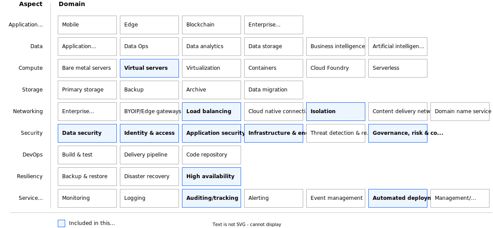

---

copyright:
  years: 2025
lastupdated: "2025-09-26"

keywords: vsi, virtual server instance, vpc, landing zone, deployable architecture, terraform, fully configurable

subcollection: deployable-reference-architectures

authors:
  - name: "Jordan Williams"

# The release that the reference architecture describes
version: 5.8.1

# Whether the reference architecture is published to Cloud Docs production.
# When set to false, the file is available only in staging. Default is false.
production: false

# Use if the reference architecture has deployable code.
# Value is the URL to land the user in the IBM Cloud catalog details page
# for the deployable architecture.
# See https://test.cloud.ibm.com/docs/get-coding?topic=get-coding-deploy-button
deployment-url: https://cloud.ibm.com/catalog/architecture/deploy-arch-ibm-slz-vsi-ef663980-4c71-4fac-af4f-4a510a9bcf68-global

docs: https://cloud.ibm.com/docs/secure-infrastructure-vpc

image_source: https://github.com/terraform-ibm-modules/terraform-ibm-landing-zone-vsi/blob/main/reference-architectures/vsi.svg

related_links:
  - title: "Landing zone for applications with virtual servers - Standard - Integrated setup with configurable services"
    url: "https://cloud.ibm.com/docs/deployable-reference-architectures?topic=deployable-reference-architectures-lz-vsi-fully-configurable-ra"
    description: "A comprehensive landing zone deployable architecture that provides virtual servers in a secure VPC for enterprise workloads."

use-case: Cybersecurity
industry: Banking,FinancialSector
compliance: FedRAMP

content-type: reference-architecture

---

{{site.data.keyword.attribute-definition-list}}

# Landing zone for applications with virtual servers - Standard - Integrated setup with configurable services variation
{: #lz-vsi-fully-configurable-ra}
{: toc-content-type="reference-architecture"}
{: toc-industry="Banking,FinancialSector"}
{: toc-use-case="Cybersecurity"}
{: toc-compliance="FedRAMP"}
{: toc-version="5.8.1"}

The Standard - Integrated setup with configurable services variation of the Landing zone for applications with virtual servers deployable architecture provides a flexible and comprehensive solution for deploying virtual servers with extensive customization options. This architecture supports multiple VSI configurations, load balancers, block storage volumes, and advanced networking features across multiple subnets and availability zones.

This variation is best suited for production environments and enterprise workloads that require advanced configurations, high availability across multiple zones, comprehensive security controls, and extensive customization options for networking, storage, and load balancing.

## Architecture diagram
{: #ra-vsi-fc-architecture-diagram}

{: caption="Standard - Integrated setup with configurable services variation of Landing zone for applications with virtual servers" caption-side="bottom"}{: external download="vsi.svg"}

## Design requirements
{: #ra-vsi-fc-design-requirements}

{: caption="Scope of the design requirements" caption-side="bottom"}

<!--
TODO: Add the typical use case for the architecture.
The use case might include the motivation for the architecture composition,
business challenge, or target cloud environments.
-->

## Components
{: #ra-vsi-fc-components}

### VPC architecture decisions
{: #ra-vsi-fc-components-arch}

For detailed information about VPC capabilities, see the [Landing zone for applications with virtual servers documentation](https://cloud.ibm.com/docs/vpc?topic=vpc-about-advanced-virtual-servers).

| Requirement | Component | Reasons for choice | Alternative choice |
|-------------|-----------|--------------------|--------------------|
| Create virtual server instances with flexible configurations | Virtual Server Instances | Support for multiple VSI profiles, custom boot volumes, and flexible placement across subnets | Single VSI configuration with limited customization |
| Provide high availability across multiple zones | Multi-zone deployment | Deploy VSIs across multiple availability zones within a region to ensure redundancy and fault tolerance | Single zone deployment with potential single point of failure |
| Enable load balancing for distributed traffic | Application Load Balancer | Distribute incoming traffic across multiple VSI instances for improved performance and availability | Direct traffic routing without load balancing |
| Support additional storage requirements | Block Storage Volumes | Attach multiple block storage volumes to VSIs for additional data storage and performance | Rely only on boot volumes with limited storage capacity |
| Provide network isolation and security | Security Groups and Network ACLs | Control inbound and outbound traffic at both the instance and subnet levels | Open network access with minimal security controls |
| Enable instance placement optimization | Placement Groups | Group VSI instances on the same physical hardware for low latency or spread across different hardware for high availability | Random instance placement without optimization |
| Support network redundancy | Multiple Subnets | Deploy across multiple subnets in different zones for network redundancy and improved availability | Single subnet deployment with limited redundancy |
{: caption="Architecture decisions" caption-side="bottom"}

### Network security architecture decisions
{: #ra-vsi-fc-components-arch-net-sec}

For comprehensive security guidance, review the [VPC security best practices](https://cloud.ibm.com/docs/vpc?topic=vpc-security-in-your-vpc).

| Requirement | Component | Reasons for choice | Alternative choice |
|-------------|-----------|--------------------|--------------------|
| Control instance-level network access | Security Groups | Define granular rules for inbound and outbound traffic at the VSI level | Default security group with minimal restrictions |
| Control subnet-level network access | Network Access Control Lists (ACLs) | Define subnet-level traffic rules as an additional security layer | Default ACL with open access |
| Enable public internet access when needed | Floating IP Addresses | Assign public IP addresses to VSIs that require internet connectivity | Private-only networking without internet access |
| Manage IP address allocation | Reserved IP Addresses | Control and maintain consistent IP addressing for VSI instances | Dynamic IP allocation without control |
| Monitor network traffic | VPC Flow Logs | Collect and analyze network traffic patterns for security and troubleshooting | No network traffic monitoring |
{: caption="Network security architecture decisions" caption-side="bottom"}

### Storage architecture decisions
{: #ra-vsi-fc-components-arch-storage}

For more information about storage options, explore [block storage options](https://cloud.ibm.com/docs/vpc?topic=vpc-block-storage-about).

| Requirement | Component | Reasons for choice | Alternative choice |
|-------------|-----------|--------------------|--------------------|
| Provide customizable boot storage | Custom Boot Volumes | Configure boot volume size, encryption, and performance characteristics | Default boot volumes with standard configuration |
| Support additional data storage | Block Storage Volumes | Attach multiple volumes with configurable size, IOPS, and encryption | Single boot volume without additional storage |
| Enable volume snapshot capabilities | Volume Snapshots | Create point-in-time snapshots for backup and recovery purposes | No backup capabilities |
| Support consistent snapshot management | Snapshot Consistency Groups | Manage snapshots across multiple volumes for data consistency | Individual volume snapshots without coordination |
{: caption="Storage architecture decisions" caption-side="bottom"}

### Key and password management architecture decisions
{: #ra-vsi-fc-components-arch-key-pw}

This architecture supports compliance requirements for regulated industries. Learn more about [IBM Cloud for Financial Services](/docs/framework-financial-services?topic=framework-financial-services-about).

| Requirement | Component | Reasons for choice | Alternative choice |
|-------------|-----------|--------------------|--------------------|
| Secure access to virtual server instances | SSH Key Management | Use SSH public keys for secure, password-less authentication | Password-based authentication with security risks |
| Support multiple access methods | Multiple SSH Keys | Allow configuration of multiple SSH keys for different users or purposes | Single SSH key with limited access control |
| Enable encrypted storage | Volume Encryption | Encrypt boot and data volumes using customer-managed or IBM-managed keys | Unencrypted storage with potential data exposure |
{: caption="Key and password management architecture decisions" caption-side="bottom"}

## Deployment options
{: #ra-vsi-fc-deployment-options}

The Standard - Integrated setup with configurable services variation supports extensive customization options:

### Instance Configuration
- Multiple VSI profiles (balanced, compute-optimized, memory-optimized)
- Custom boot volume sizes and performance characteristics
- Variable number of instances per subnet
- Placement group configurations for performance optimization

### Storage Configuration
- Multiple block storage volumes per instance
- Configurable volume sizes, IOPS, and encryption
- Snapshot consistency groups for backup coordination
- Boot volume snapshot support for disaster recovery

### Network Configuration
- Multi-subnet deployments across availability zones
- Custom security groups with granular rule definitions
- Network ACLs for subnet-level traffic control
- Floating IP and reserved IP address management

### Load Balancer Configuration
- Application load balancers with custom pools and listeners
- Health check configurations for backend monitoring
- SSL termination and certificate management
- Multiple load balancer configurations per deployment

For detailed configuration options, learn about [load balancer configurations](https://cloud.ibm.com/docs/vpc?topic=vpc-load-balancers).

## Next steps
{: #ra-vsi-fc-next-steps}

- Deploy the Standard - Integrated setup with configurable services variation from the [IBM Cloud catalog](https://cloud.ibm.com/catalog/architecture/deploy-arch-ibm-slz-vsi-ef663980-4c71-4fac-af4f-4a510a9bcf68-global)
- Follow the [deployment guide](/docs/deployable-reference-architectures?topic=deployable-reference-architectures-deploy-arch-overview) for step-by-step instructions
