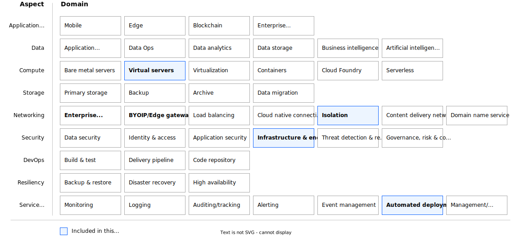

---

copyright:
  years: 2025
lastupdated: "2025-09-26"

keywords: vsi, virtual server instance, vpc, landing zone, deployable architecture, terraform, quickstart

subcollection: deployable-reference-architectures

authors:
  - name: "Jordan Williams"

# The release that the reference architecture describes
version: 5.8.1

# Whether the reference architecture is published to Cloud Docs production.
# When set to false, the file is available only in staging. Default is false.
production: false

# Use if the reference architecture has deployable code.
# Value is the URL to land the user in the IBM Cloud catalog details page
# for the deployable architecture.
# See https://test.cloud.ibm.com/docs/get-coding?topic=get-coding-deploy-button
deployment-url: https://cloud.ibm.com/catalog/architecture/deploy-arch-ibm-slz-vsi-ef663980-4c71-4fac-af4f-4a510a9bcf68-global

docs: https://cloud.ibm.com/docs/secure-infrastructure-vpc

image_source: https://github.com/terraform-ibm-modules/terraform-ibm-landing-zone-vsi/blob/main/reference-architectures/vsi-qs.svg

related_links:
  - title: "Virtual Server Instance on VPC - Fully configurable variation"
    url: "https://cloud.ibm.com/docs/deployable-reference-architectures?topic=deployable-reference-architectures-vsi-fully-configurable-ra"
    description: "The Virtual Server Instance on VPC Fully configurable variation is a deployable architecture that provides extensive customization options for virtual servers in a VPC environment."
  - title: "Landing zone VPC with VSI"
    url: "https://cloud.ibm.com/docs/deployable-reference-architectures?topic=deployable-reference-architectures-vsi-ra"
    description: "A comprehensive landing zone deployable architecture that provides virtual servers in a secure VPC for enterprise workloads."

use-case: Cybersecurity
industry: Banking,FinancialSector

content-type: reference-architecture

---

{{site.data.keyword.attribute-definition-list}}

# Virtual Server Instance on VPC - QuickStart variation
{: #vsi-ra-qs}
{: toc-content-type="reference-architecture"}
{: toc-industry="Banking,FinancialSector"}
{: toc-use-case="Cybersecurity"}
{: toc-version="5.8.1"}

The QuickStart variation of the Virtual Server Instance on VPC deployable architecture provides a simplified and fast deployment path for getting started with virtual servers on IBM Cloud VPC. This variation is designed for rapid deployment with sensible defaults, making it ideal for demonstration, development, proof-of-concept environments, and users who want to get started quickly with minimal configuration.

## Architecture diagram
{: #ra-vsi-qs-architecture-diagram}

{: caption="QuickStart variation of Landing zone for applications with virtual servers" caption-side="bottom"}{: external download="vsi-qs.svg"}

## Design requirements
{: #ra-vsi-qs-design-requirements}

{: caption="Scope of the design requirements" caption-side="bottom"}

<!--
TODO: Add the typical use case for the architecture.
The use case might include the motivation for the architecture composition,
business challenge, or target cloud environments.
-->

## Components
{: #ra-vsi-qs-components}

### VPC architecture decisions
{: #ra-vsi-qs-components-arch}

For detailed information about VPC capabilities, review the [Virtual Server Instance on VPC documentation](https://cloud.ibm.com/docs/vpc?topic=vpc-about-advanced-virtual-servers).

| Requirement | Component | Reasons for choice | Alternative choice |
|-------------|-----------|--------------------|--------------------|
| Provide quick deployment with minimal configuration | Simplified VSI Configuration | Deploy virtual servers with pre-configured, optimized settings for common use cases | Complex multi-step configuration process |
| Create a basic VPC environment | Single VPC with Multiple Subnets | Create a VPC with subnets across multiple availability zones for basic redundancy | Complex multi-VPC setup with transit gateways |
| Enable basic virtual server functionality | Standard Virtual Server Instances | Deploy VSIs with balanced profiles suitable for general workloads | Specialized or high-performance instance types |
| Provide essential network connectivity | Default Security Groups | Configure security groups with commonly needed ports and protocols | Extensive custom security group configurations |
| Support basic storage needs | Standard Boot Volumes | Use default boot volume sizes with standard performance | Complex storage configurations with multiple volumes |
| Enable simple placement | Automatic Placement | Allow IBM Cloud to optimally place instances without complex placement group configurations | Custom placement group configurations |
{: caption="Architecture decisions" caption-side="bottom"}

### Network security architecture decisions
{: #ra-vsi-qs-components-arch-net-sec}

Learn about [VPC networking fundamentals](https://cloud.ibm.com/docs/vpc?topic=vpc-about-networking-for-vpc) for more information about networking in VPC environments.

| Requirement | Component | Reasons for choice | Alternative choice |
|-------------|-----------|--------------------|--------------------|
| Provide basic network security | Default Security Groups | Configure security groups with essential rules for common applications (SSH, HTTP, HTTPS) | Complex custom security group rules |
| Enable subnet-level security | Standard Network ACLs | Use default or slightly modified Network ACLs for subnet-level traffic control | Highly customized ACL configurations |
| Support internet connectivity when needed | Optional Floating IP | Provide the option to assign floating IPs to instances that need internet access | Always assign floating IPs or never assign them |
| Maintain consistent IP addressing | Standard IP Management | Use VPC's default IP allocation with optional reserved IP addresses | Complex IP address management schemes |
{: caption="Network security architecture decisions" caption-side="bottom"}

### Storage architecture decisions
{: #ra-vsi-qs-components-arch-storage}

| Requirement | Component | Reasons for choice | Alternative choice |
|-------------|-----------|--------------------|--------------------|
| Provide adequate boot storage | Standard Boot Volumes | Use default boot volume sizes that meet common application requirements | Oversized or undersized boot volumes |
| Support basic data storage needs | Optional Block Storage | Provide option to attach additional block storage volumes when needed | Complex multi-volume configurations |
| Enable basic backup capabilities | Simple Snapshot Support | Support basic snapshot functionality for backup purposes | Complex snapshot scheduling and lifecycle management |
{: caption="Storage architecture decisions" caption-side="bottom"}

### Key and password management architecture decisions
{: #ra-vsi-qs-components-arch-key-pw}

This architecture supports compliance requirements for regulated industries. Read about [IBM Cloud for Financial Services](/docs/framework-financial-services?topic=framework-financial-services-about) for more information about compliance frameworks.

| Requirement | Component | Reasons for choice | Alternative choice |
|-------------|-----------|--------------------|--------------------|
| Provide secure access to virtual servers | SSH Key Authentication | Use SSH public keys for secure authentication to virtual server instances | Password-based authentication |
| Simplify key management | Single SSH Key Configuration | Support a single SSH key for simplified access management | Complex multi-key management |
| Enable encrypted storage | Default Volume Encryption | Use IBM-managed encryption keys for volume encryption with minimal configuration | Complex customer-managed key configurations |
{: caption="Key and password management architecture decisions" caption-side="bottom"}

## Deployment considerations
{: #ra-vsi-qs-deployment-considerations}

### When to use QuickStart variation
- Development and testing environments
- Proof-of-concept projects
- Learning and experimentation
- Temporary workloads
- Simple web applications
- Basic compute requirements

### When to consider Standard variation
- Production environments with complex requirements
- Multi-tier applications requiring extensive customization
- Compliance requirements needing specific configurations
- High-availability architectures
- Performance-critical applications
- Complex networking requirements

Explore the [Standard variation](https://cloud.ibm.com/docs/deployable-reference-architectures?topic=deployable-reference-architectures-vsi-fully-configurable-ra) for advanced features and extensive customization options.

## Next steps
{: #ra-vsi-qs-next-steps}

- Deploy the QuickStart variation from the [IBM Cloud catalog](https://cloud.ibm.com/catalog/architecture/deploy-arch-ibm-slz-vsi-ef663980-4c71-4fac-af4f-4a510a9bcf68-global)
- Follow the [deployment guide](/docs/deployable-reference-architectures?topic=deployable-reference-architectures-deploy-arch-overview) for step-by-step instructions
